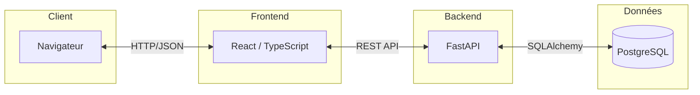
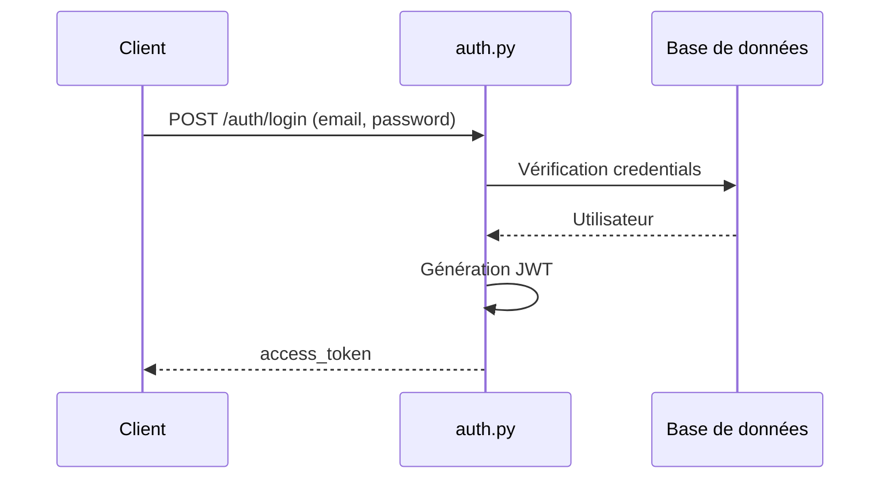
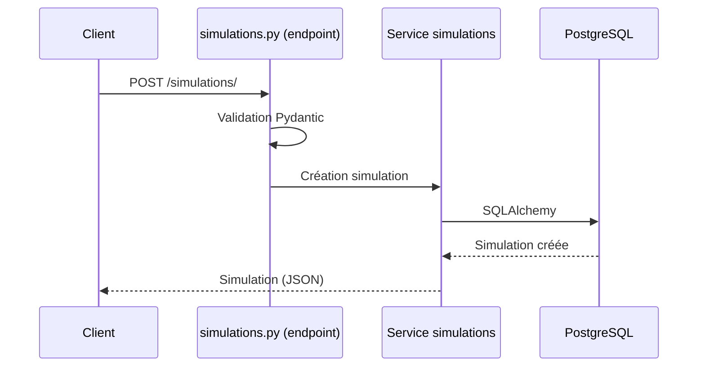
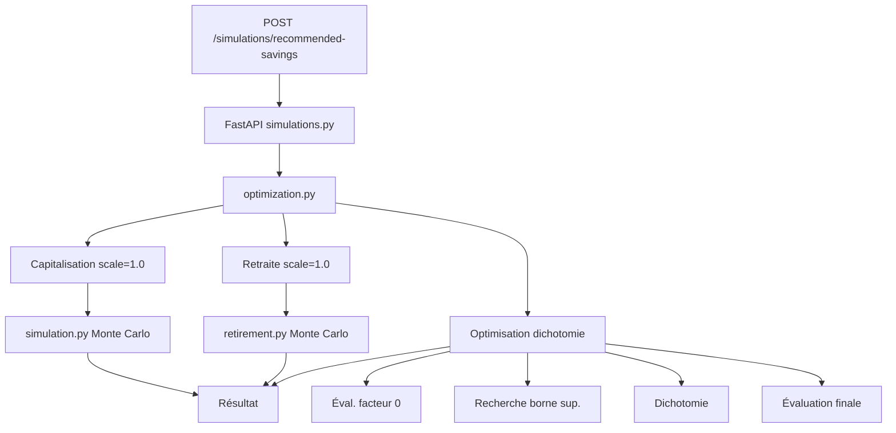
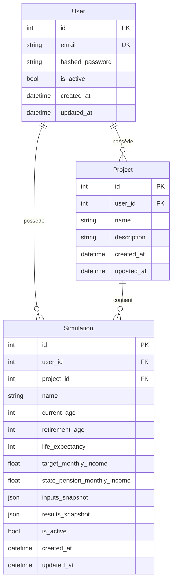
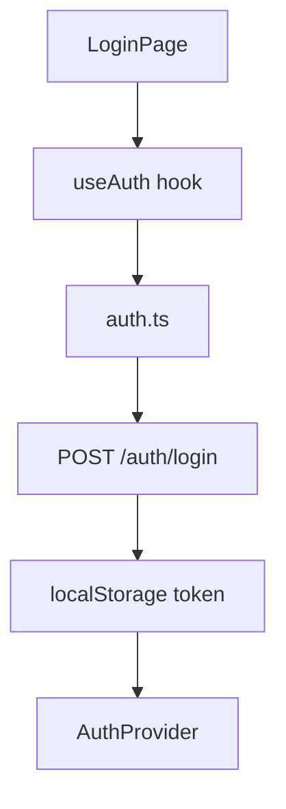
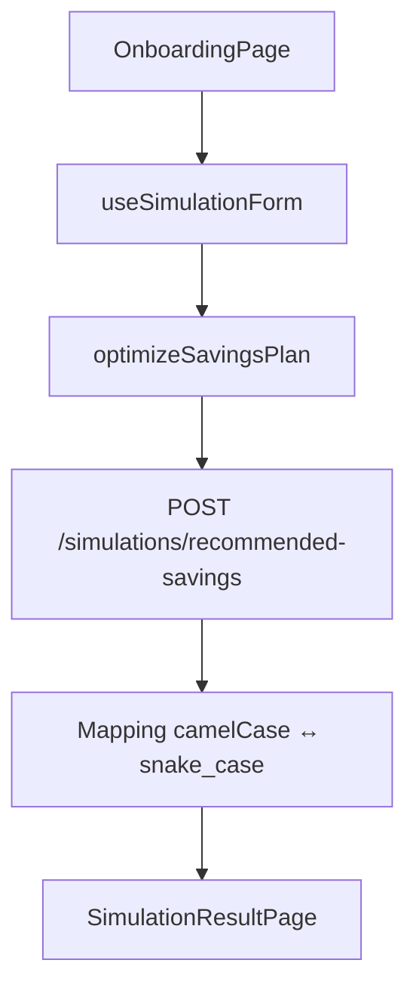
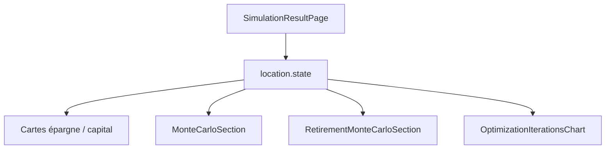

# Architecture de LongView

## Vue d'ensemble

LongView est une application web full-stack avec une architecture séparée entre backend (Python/FastAPI) et frontend (React/TypeScript).



## Backend

### Structure des répertoires

```
backend/
├── app/
│   ├── api/                    # Endpoints API
│   │   ├── deps.py            # Dépendances (auth, DB)
│   │   ├── api_v1_router.py   # Routeur principal
│   │   └── v1/
│   │       └── endpoints/
│   │           ├── auth.py     # Authentification
│   │           ├── projects.py # Gestion des projets
│   │           └── simulations.py # Simulations
│   ├── core/                   # Configuration
│   │   ├── config.py          # Variables d'environnement
│   │   └── security.py        # JWT, hash passwords
│   ├── db/                     # Base de données
│   │   ├── base.py            # Session SQLAlchemy
│   │   └── base_class.py      # Classe de base des modèles
│   ├── models/                 # Modèles SQLAlchemy
│   │   ├── user.py
│   │   ├── project.py
│   │   └── simulation.py
│   ├── schemas/                # Schémas Pydantic
│   │   ├── auth.py
│   │   ├── user.py
│   │   ├── project.py
│   │   ├── simulation.py
│   │   └── projections.py     # Schémas pour les calculs
│   ├── services/               # Logique métier
│   │   ├── users.py
│   │   ├── projects.py
│   │   ├── simulations.py
│   │   ├── capitalization.py  # Calculs déterministes
│   │   ├── monte_carlo/        # Simulations Monte Carlo
│   │   │   ├── simulation.py  # Capitalisation
│   │   │   ├── retirement.py  # Retraite
│   │   │   ├── optimization.py # Optimisation
│   │   │   ├── returns.py      # Génération rendements
│   │   │   ├── correlations.py # Corrélations
│   │   │   └── statistics.py  # Statistiques
│   │   ├── taxation.py        # Calcul des taxes
│   │   └── progress.py        # Suivi de progression
│   └── main.py                 # Point d'entrée FastAPI
├── migrations/                 # Migrations Alembic
└── requirements.txt            # Dépendances Python
```

### Flux de données

#### 1. Authentification



#### 2. Création de simulation



#### 3. Optimisation d'épargne



### Modèles de données



#### User

```python
class User(Base):
    id: int
    email: str (unique)
    hashed_password: str
    is_active: bool
    created_at: datetime
    updated_at: datetime
```

#### Project

```python
class Project(Base):
    id: int
    user_id: int (FK → User)
    name: str
    description: str | None
    created_at: datetime
    updated_at: datetime
```

#### Simulation

```python
class Simulation(Base):
    id: int
    user_id: int (FK → User)
    project_id: int | None (FK → Project)
    name: str
    current_age: int
    retirement_age: int
    life_expectancy: int | None
    target_monthly_income: float | None
    state_pension_monthly_income: float | None
    inputs_snapshot: JSON
    results_snapshot: JSON | None
    is_active: bool
    created_at: datetime
    updated_at: datetime
```

### Services

#### Monte Carlo Service

Le service Monte Carlo est organisé en modules :

- **simulation.py** : Simulation de capitalisation
- **retirement.py** : Simulation de retraite
- **optimization.py** : Optimisation par dichotomie
- **returns.py** : Génération de rendements aléatoires
- **correlations.py** : Gestion des corrélations (Cholesky)
- **statistics.py** : Calculs statistiques (percentiles, etc.)

#### Taxation Service

Le service de taxation calcule les impôts selon :
- Type de compte (PEA, PER, Assurance-vie, etc.)
- Durée de détention
- Taux d'imposition (TMI)
- Statut fiscal (célibataire/couple)

## Frontend

### Structure des répertoires

```
frontend/src/
├── components/          # Composants React
│   ├── layout/         # Layout principal
│   ├── onboarding/     # Étapes du formulaire
│   ├── results/        # Visualisations résultats
│   └── shared/         # Composants partagés
├── pages/              # Pages de l'application
│   ├── HomePage.tsx
│   ├── OnboardingPage.tsx
│   ├── SimulationResultPage.tsx
│   ├── ProjectsPage.tsx
│   └── ...
├── services/           # Services API
│   ├── auth.ts
│   ├── simulations.ts
│   └── projects.ts
├── hooks/              # Hooks React personnalisés
│   ├── useAuth.ts
│   ├── useSimulationForm.ts
│   └── ...
├── types/              # Types TypeScript
│   ├── simulation.ts
│   ├── project.ts
│   └── user.ts
├── providers/          # Context providers
│   ├── AuthProvider.tsx
│   └── ThemeModeProvider.tsx
└── lib/                # Utilitaires
    └── api-client.ts   # Client API Axios
```

### Flux de données frontend

#### 1. Authentification



#### 2. Création de simulation



#### 3. Affichage des résultats



### Gestion d'état

- **React Query** : Cache et synchronisation des données API
- **Context API** : État global (auth, thème)
- **Local State** : État local des composants (useState)
- **SessionStorage** : Persistance temporaire (simulations en cours)

### Mapping des données

Le frontend convertit automatiquement entre formats :

- **Frontend → Backend** : `camelCase` → `snake_case`
- **Backend → Frontend** : `snake_case` → `camelCase`

Les fonctions de mapping sont dans `services/simulations.ts` :
- `mapSimulationInputToApi()`
- `buildMonteCarloResultFromApi()`
- `buildRetirementMonteCarloResultFromApi()`

## Communication API

### Format des requêtes

Toutes les requêtes utilisent JSON :

```json
{
  "field_name": "value",
  "nested_object": {
    "nested_field": "value"
  }
}
```

### Format des réponses

Les réponses sont également en JSON avec le format `snake_case` :

```json
{
  "field_name": "value",
  "nested_object": {
    "nested_field": "value"
  }
}
```

### Gestion des erreurs

Les erreurs suivent le format FastAPI standard :

```json
{
  "detail": "Message d'erreur"
}
```

Le frontend intercepte les erreurs via Axios interceptors et les affiche à l'utilisateur.

## Sécurité

### Authentification

- **JWT** : Tokens signés avec secret
- **Expiration** : Tokens valides 24h
- **Refresh** : Pas implémenté actuellement

### Autorisation

- **Isolation des données** : Chaque utilisateur ne voit que ses propres données
- **Vérification** : Middleware vérifie `user_id` sur chaque requête

### Validation

- **Backend** : Validation Pydantic sur tous les inputs
- **Frontend** : Validation TypeScript + validation manuelle

## Performance

### Optimisations backend

- **Itérations adaptatives** : Réduction du nombre d'itérations Monte Carlo en début de recherche
- **Batch processing** : Vérification de convergence par batchs
- **Calcul vectorisé** : Utilisation de NumPy

### Optimisations frontend

- **React Query** : Cache des requêtes API
- **Lazy loading** : Chargement à la demande des composants
- **Memoization** : useMemo pour les calculs coûteux

## Déploiement

Voir [DEPLOIEMENT.md](./DEPLOIEMENT.md) pour les détails de déploiement.

## Tests

### Backend

Les tests sont dans le répertoire `tests/` (à créer) :
- Tests unitaires des services
- Tests d'intégration des endpoints
- Tests des algorithmes Monte Carlo

### Frontend

Les tests sont dans `frontend/src/__tests__/` (à créer) :
- Tests unitaires des composants
- Tests des hooks
- Tests d'intégration des services


