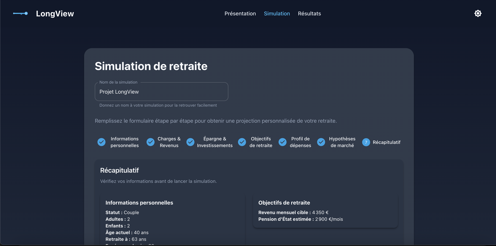
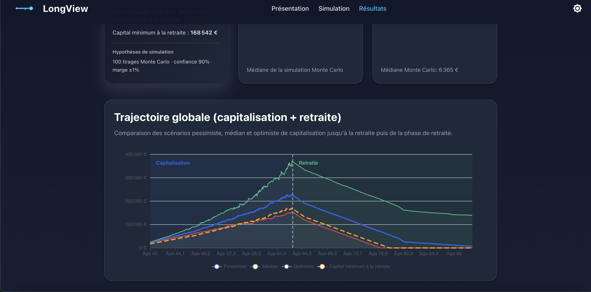

# Coder des algorithmes complexes avec l'IA : ce que j'ai appris en développant un simulateur de retraite

## Introduction

Dans [l'article précédent](https://www.benjamin-maillard.fr/?article=architecture-web-moderne-ia-retour-experience), j'ai présenté l'architecture technique d'une application IA. Cette fois, je m'attaque à un sujet différent : **peut-on réellement coder des algorithmes mathématiques complexes avec l'IA ?**

Le terrain d'expérimentation : LongView, un simulateur de retraite algorithmique que j'ai développé en parallèle du projet œnotechnique. Ici, pas de vision par IA ni d'agents conversationnels, mais de la modélisation financière pure : simulations Monte Carlo, optimisation par dichotomie, décomposition de Cholesky pour les corrélations, et même du Reinforcement Learning.

👉 **Question centrale au niveau stratégique :** L'IA peut-elle assister efficacement un non-expert en mathématiques financières pour produire des algorithmes robustes et performants ?

## Le contexte : simuler l'incertitude financière

### Le problème à résoudre

Prévoir la retraite d'un individu n'est pas une simple addition. Il faut modéliser :

▹ L'évolution des marchés financiers (actions, obligations, livrets)
▹ Les corrélations entre classes d'actifs
▹ L'inflation, avec sa propre volatilité
▹ La fiscalité française (PEA, PER, assurance-vie, CTO)
▹ Les différentes phases de vie (capitalisation, retraite, profil de dépenses)

Un calcul déterministe ne suffit pas. La vraie question est : *quelle est la probabilité d'atteindre mon objectif ?*



*L'interface de paramétrage permet de saisir l'ensemble des informations nécessaires : profils des adultes, comptes d'investissement, objectifs de retraite, hypothèses de marché, etc.*

### Ma contrainte de départ

Je ne suis pas actuaire ni expert en finance quantitative. Je comprends les concepts, mais je n'avais jamais implémenté de simulation Monte Carlo ni d'optimisation par dichotomie en production.

Pourtant, en quelques semaines, j'ai produit un moteur de simulation complet, testé et fonctionnel.

## L'IA comme accélérateur algorithmique : ce qui fonctionne

### Pattern 1 : Décomposer le problème, pas le déléguer

L'IA ne peut pas "inventer" un algorithme financier à partir de rien. En revanche, elle excelle pour :

▹ **Traduire une intuition en pseudo-code** : j'explique le concept en langage naturel, elle propose une structure
▹ **Générer des implémentations de référence** : algorithmes classiques (Monte Carlo, Cholesky) avec un code propre
▹ **Identifier les edge cases** : "que se passe-t-il si le capital s'épuise avant la fin de vie ?"
▹ **Optimiser les performances** : vectorisation NumPy, batch processing, itérations adaptatives

👉 **Enseignement clé :** L'IA n'a pas remplacé ma compréhension du problème. Elle a accéléré la traduction de cette compréhension en code fonctionnel.

### Pattern 2 : Itérer par raffinement successif

L'approche la plus efficace a été un dialogue itératif :

1. **Première version naïve** : "Génère une simulation Monte Carlo basique"
2. **Ajout de complexité** : "Maintenant, ajoute des rendements corrélés entre classes d'actifs"
3. **Optimisation** : "Le calcul est trop lent, propose une version vectorisée"
4. **Edge cases** : "Que se passe-t-il si le capital tombe à zéro avant l'espérance de vie ?"
5. **Validation** : "Génère des tests unitaires pour vérifier les cas limites"

Cette approche m'a permis de passer d'un prototype fonctionnel à un algorithme robuste en quelques itérations.

### Pattern 3 : Challenger le modèle avec un autre modèle

J'ai utilisé une technique particulièrement efficace : demander à un modèle de valider ou challenger le code généré par un autre.

```
Premier modèle : "Voici l'implémentation de la décomposition de Cholesky"
Second modèle  : "Vérifie cette implémentation et identifie les problèmes potentiels"
```

Cette approche a permis d'identifier des erreurs subtiles que je n'aurais pas détectées seul : problèmes de précision numérique, cas dégénérés, hypothèses implicites incorrectes.

## Les algorithmes produits : un aperçu technique

### Simulation Monte Carlo avec convergence adaptative

L'algorithme génère des milliers de scénarios probabilistes pour estimer la distribution du capital futur :

▹ **Génération de rendements corrélés** via décomposition de Cholesky
▹ **Ajustement pour l'inflation** modélisée comme processus stochastique
▹ **Convergence adaptative** : moins d'itérations au début (exploration rapide), plus à la fin (précision)
▹ **Batch processing** : vérification de convergence par lots pour optimiser le temps de calcul

**Temps de calcul :** ~1-2 secondes pour 200 itérations, ~30-60 secondes pour l'optimisation complète.



*Le graphique présente la phase de capitalisation avec les percentiles 10, 50 et 90%, montrant la distribution probabiliste du capital au fil du temps. Les courbes illustrent l'incertitude inhérente aux projections financières.*

### Optimisation par dichotomie

Pour trouver l'épargne mensuelle minimale permettant d'atteindre un objectif :

▹ **Recherche binaire** sur le facteur d'échelle des versements
▹ **Pénalité pour épuisement précoce** : si le capital s'épuise avant l'espérance de vie
▹ **Évaluation finale haute précision** : réévaluation avec le maximum d'itérations Monte Carlo

### Reinforcement Learning (expérimental)

J'ai également expérimenté avec le Reinforcement Learning pour apprendre des stratégies adaptatives :

▹ **Environnement simulé** reproduisant l'évolution financière
▹ **Agent PPO** (Proximal Policy Optimization) de Stable-Baselines3
▹ **Stratégie apprise** : ajustement dynamique de l'épargne et de l'allocation d'actifs

Cette partie reste expérimentale, mais démontre la capacité de l'IA à aider sur des approches avancées.

## Ce qui résiste : les limites de l'assistance IA

### Le piège de la confiance aveugle

L'IA génère du code qui *semble* correct. Sans validation rigoureuse, des erreurs subtiles passent inaperçues :

▹ **Hypothèses implicites incorrectes** : l'IA peut supposer que les rendements sont normalement distribués, alors que la réalité est plus complexe
▹ **Erreurs de signe ou d'indexation** : classiques mais coûteuses
▹ **Optimisations prématurées** : l'IA peut optimiser un code... qui ne fait pas ce qu'on attend

👉 **Règle critique :** Toujours tester avec des cas simples dont on connaît le résultat attendu avant de passer aux cas complexes.

### La documentation et le raisonnement

L'IA peut générer de la documentation, mais elle ne peut pas garantir que le code fait réellement ce que la documentation décrit. J'ai dû régulièrement :

▹ Relire le code ligne par ligne pour comprendre la logique réelle
▹ Ajouter des logs de débogage pour vérifier les valeurs intermédiaires
▹ Créer des tests de régression pour éviter les régressions lors des refactorings

### Les choix d'architecture restent humains

L'IA m'a proposé plusieurs architectures différentes pour le moteur de simulation. Le choix final a reposé sur des critères que l'IA ne peut pas évaluer seule :

▹ **Maintenabilité à long terme** : préférer la lisibilité à la performance marginale
▹ **Extensibilité** : anticiper les évolutions futures (nouveaux types de comptes, nouvelles règles fiscales)
▹ **Debuggabilité** : faciliter l'investigation en cas de problème

## Enseignements stratégiques

### 1. L'IA démocratise l'accès aux algorithmes complexes

Un responsable technique sans expertise en finance quantitative peut aujourd'hui produire des algorithmes sophistiqués. Ce qui aurait nécessité l'embauche d'un spécialiste ou des mois d'auto-formation se fait en quelques semaines.

👉 **Impact :** La barrière d'entrée pour créer des outils d'aide à la décision algorithmiques s'effondre.

### 2. La valeur se déplace vers la formulation du problème

L'IA peut implémenter n'importe quel algorithme. La vraie difficulté est de savoir **quel algorithme** implémenter et **pourquoi**.

Dans mon cas :
- Pourquoi Monte Carlo plutôt qu'un calcul déterministe ?
- Quelle tolérance de convergence est acceptable ?
- Comment modéliser l'épuisement précoce du capital ?

Ces questions relèvent de la compréhension du domaine, pas de la technique.

### 3. La validation devient critique

Plus l'IA génère de code rapidement, plus le risque de défauts augmente. J'ai passé presque autant de temps à valider qu'à générer :

▹ Tests unitaires systématiques
▹ Comparaison avec des résultats de référence
▹ Revue croisée par différents modèles d'IA
▹ Tests de robustesse (edge cases, valeurs extrêmes)

### 4. Le duo humain-IA surpasse les deux séparément

Ni l'IA seule ni moi seul n'aurions pu produire ce résultat :

- **L'IA seule** aurait généré du code plausible mais potentiellement incorrect
- **Moi seul** aurais passé des mois à implémenter et débugger

Ensemble, nous avons produit un moteur de simulation fonctionnel en quelques semaines.

## Chiffres clés

| Métrique | Valeur |
|----------|--------|
| **Lignes de code algorithme** | ~2 500 |
| **Temps de développement** | ~3 semaines |
| **Estimation sans IA** | 3-4 mois |
| **Gain de temps estimé** | 70-80% |
| **Précision des simulations** | Convergence < 1% d'erreur |

## Conclusion

Cette expérimentation confirme que l'IA transforme profondément la capacité à produire des algorithmes complexes. Elle ne remplace pas l'expertise, mais elle la démocratise et l'accélère.

Pour les responsables techniques et les CODIR, l'enseignement est clair : **l'IA n'est plus réservée aux data scientists**. Un profil généraliste avec une bonne compréhension du problème à résoudre peut aujourd'hui produire des outils algorithmiques sophistiqués.

👉 **Le rôle du décideur évolue :** de "faire faire" à "formuler le problème et valider la solution".

Le prochain article abordera un sujet complémentaire : comment industrialiser ces algorithmes pour une utilisation en production, avec les enjeux de scalabilité, de monitoring et de maintenance.

---

### Pour aller plus loin

**Projet réalisé hors cadre professionnel, avec l'aide de Cursor, Claude et GPT, démontrant qu'il est possible de créer des algorithmes financiers complexes sans expertise préalable en la matière.**

▹ **Technologies utilisées :** Python, FastAPI, NumPy, Stable-Baselines3 (RL)
▹ **Suivez-moi sur LinkedIn** pour les prochains articles et retours d'expérience : [linkedin.com/in/benjaminmaillard](https://www.linkedin.com/in/benjaminmaillard)
▹ **Partagez cet article** si vous pensez qu'il peut aider d'autres responsables techniques dans leur réflexion sur l'intégration de l'IA

**Questions ou retours d'expérience ?** N'hésitez pas à commenter ou me contacter sur LinkedIn — j'échange volontiers sur ces sujets.

#IA #Algorithmes #MonteCarlo #FinTech #TransformationDigitale #Python #MachineLearning #RetourExperience #CODIR #DSI
