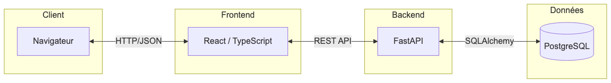
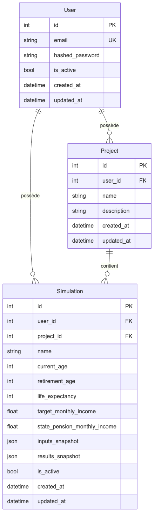
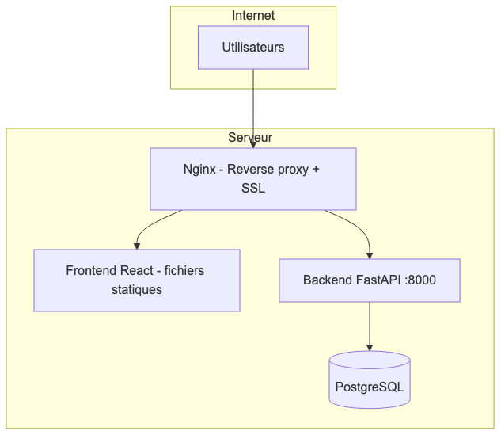
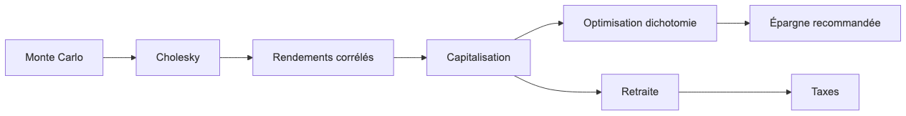

# Diagrammes de la documentation LongView

Ce document regroupe les diagrammes Mermaid utilisés dans la documentation, avec des versions exportées en images pour les plateformes qui ne rendent pas Mermaid nativement.

## Vue d'ensemble

Les diagrammes sont présents dans :

- **[ARCHITECTURE.md](./ARCHITECTURE.md)** : architecture système, flux backend/frontend, modèles de données
- **[DEPLOIEMENT.md](./DEPLOIEMENT.md)** : architecture de déploiement
- **[ALGORITHMES.md](./ALGORITHMES.md)** : chaîne d'algorithmes, Monte Carlo, dichotomie, scénarios retraite

## Index des diagrammes

### 1. Architecture globale (ARCHITECTURE.md)

Client ↔ Frontend React ↔ Backend FastAPI ↔ PostgreSQL.



### 2. Modèles de données (ARCHITECTURE.md)

Entité-relation : User, Project, Simulation.



### 3. Architecture de déploiement (DEPLOIEMENT.md)

Nginx → Frontend statique + Backend FastAPI → PostgreSQL.



### 4. Chaîne des algorithmes (ALGORITHMES.md)

Monte Carlo → Cholesky → capitalisation → optimisation → épargne recommandée ; retraite et taxes.



### Autres diagrammes (Mermaid dans les .md)

Les flux détaillés suivants sont en Mermaid directement dans les fichiers :

- **ARCHITECTURE.md** : flux d'authentification (sequenceDiagram), création de simulation (sequenceDiagram), optimisation d'épargne (flowchart), flux frontend (authentification, simulation, résultats)
- **ALGORITHMES.md** : étapes du calcul Monte Carlo, principe de la dichotomie, scénarios de retraite (P10/P50/P90)

Ils s'affichent automatiquement sur GitHub, GitLab et tout lecteur supportant Mermaid.

## Rendu Mermaid

Sur GitHub, GitLab et la plupart des outils qui supportent Mermaid, les blocs de code ` ```mermaid ` dans les fichiers `.md` sont rendus automatiquement. Les images dans `documentation/images/` servent de repli ou pour l’export PDF / autres formats.

## Régénération des images

Pour régénérer les images à partir du code Mermaid, vous pouvez utiliser :

- [Mermaid CLI](https://github.com/mermaid-js/mermaid-cli) : `mmdc -i diagramme.mmd -o diagramme.png`
- Ou copier le contenu Mermaid depuis ARCHITECTURE.md, DEPLOIEMENT.md et ALGORITHMES.md dans des fichiers `.mmd` puis les exporter.
